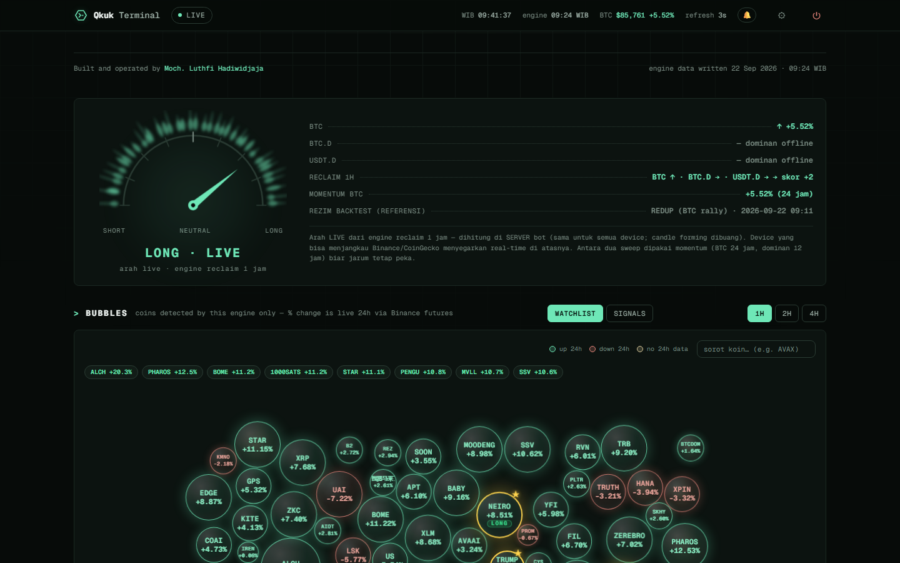
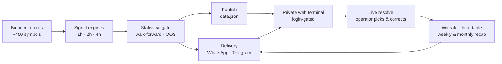
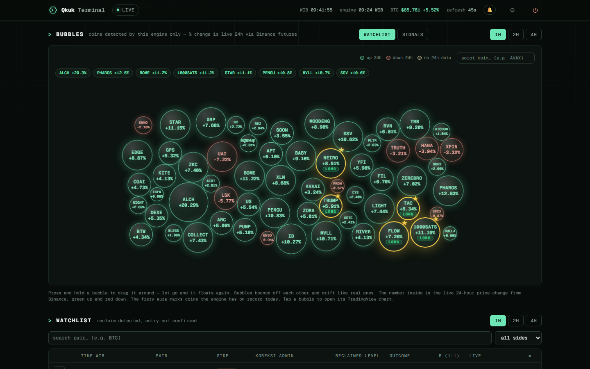

# 📊 Qkuk Terminal — Showcase

**An autonomous crypto trading system — and the private web terminal that surfaces it.**

*This is a public showcase. The engine itself is closed-source: this repo shows what it
is, how the pieces fit together, and what it looks like — not how the strategy works.*

 

---

## What it is

Qkuk Terminal is two pieces that share one dataset:

**🤖 The bot** — a Python engine that watches Binance USDT-perpetual futures across
~450 symbols in real time, hunts reclaim-style structures on the **1h / 2h / 4h**
timeframes, and pushes watchlists + signals to **WhatsApp** and **Telegram**.

**🖥️ The terminal** — a private, login-gated web dashboard (GitHub Pages + vanilla JS)
where every signal can be inspected, corrected and *resolved* by the operator — so the
accuracy you see is **live, operator-verified performance, not a backtest**.

## How it fits together

The loop closes: what the operator resolves in the terminal feeds back into daily
digests and monthly accuracy recaps — the system keeps itself honest.

## Inside the terminal

| | |
|:--|:--|
| 🧭 **Altseason gauge** | Live altcoin direction from BTC price + dominance, weighted, with hourly history |
| 🫧 **Bubbles** | Draggable bubble canvas of engine-detected coins — size & heat = 24h move |
| 📋 **Watchlist & signals** | Searchable, filterable tables per timeframe with admin corrections |
| 🎯 **Live resolve** | Operator picks coins, corrects direction, marks win/loss — real accuracy |
| 🌡️ **Heat table** | Winrate by WIB hour × channel, color-coded, click-to-filter |
| 🔔 **Notifications** | New signals arrive as clickable toasts with sound |
| 🔐 **Private gate** | Login screen with animated blockchain transition |

## Stack

`Python` · `pandas` · `NumPy` · `SciPy` — engine
`Node.js` · vanilla JS · SVG/Canvas — terminal
`WhatsApp API` · `Telegram Bot API` · `Binance API`

## Why closed source

The edge *is* the strategy — publishing thresholds, gates and weights would spend it.
What can be judged publicly is the engineering discipline: statistical gating, decay
monitoring, and accuracy that comes from operator-resolved live picks instead of a
backtest that can be tuned until it lies.

> ⚠️ **Disclaimer** — Qkuk Terminal is a personal research tool, not financial advice.

## License

[MIT](LICENSE) © Moch Luthfi Hadiwidjaja
